<p align="center">
  
</p>
<p align="center"><strong>Магия, которая меняет поле боя.</strong><br />Физический экшен на маленьких разрушаемых планетах · Unity 6 · локальная альфа</p>

<p align="center">
  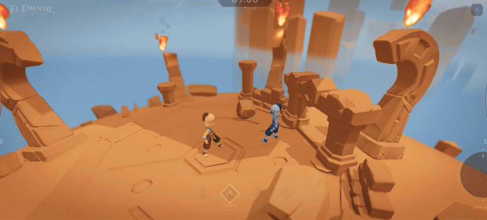
</p>
<p align="center"><sub>Текущая локальная арена · настоящий бот и физика · постановка команд для записи</sub></p>

Вырви камень из арены, собери обломки в броню, подними стену между собой и противником. Проведи огненный поток через собственную горящую дорожку, взлети на струях из стоп и выпусти накопленное пламя сферической волной.

**El-Emental** — разрабатываемая игра о взаимодействии стихий, физики и окружения. Сейчас основной маршрут — дуэль с ботом в **EarthCoreSlice**, с доступной магией **Земли и Огня**. Сетевая Земля развивается отдельно; Вода и Воздух пока представлены лабораторными прототипами и оформлением меню.

## Земля: строй, разбирай, возвращай удар

<table>
<tr>
<td align="center">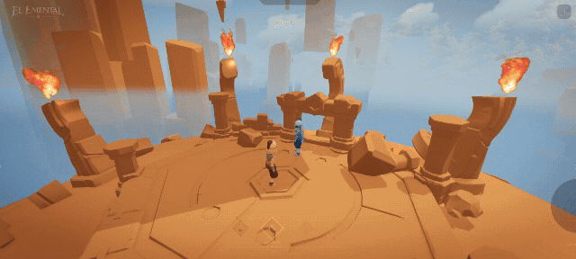<br /><sub>Гравитационный захват и залп</sub></td>
<td align="center">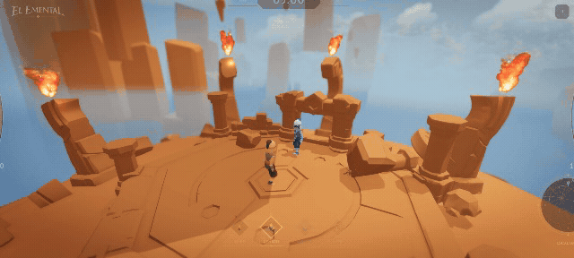<br /><sub>Строительство и восстановление</sub></td>
</tr>
<tr>
<td align="center">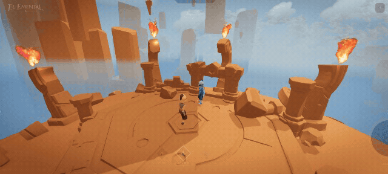<br /><sub>Движение и удар при приземлении</sub></td>
<td align="center">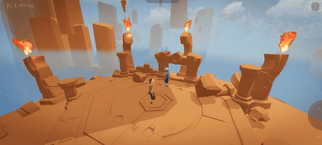<br /><sub>Контрудар по камню</sub></td>
</tr>
</table>

- **Телекинез и масса:** поднимай готовые камни или формируй новые, меняй дистанцию удержания, бросай и сталкивай физические объекты.
- **Стены и платформы:** рисуй линию или замкнутый контур по поверхности, разрушай конструкции и собирай их фрагменты обратно.
- **Гравитационный захват:** держи группу обломков, раскалывай удерживаемую глыбу, выпускай отдельные части или сжатый залп.
- **Броня → купол → орбита:** разворачивай каменные пластины, стреляй ими по одной или залпом, выпускай радиальную волну.
- **Движение и контратаки:** каменный сёрф, прыжок на столбе, ряды столбов, удар при приземлении, защита от летящих камней и серия выстрелов с ударами руками и ногами.

## Огонь: направляй, накапливай, распространяй

<table>
<tr>
<td align="center">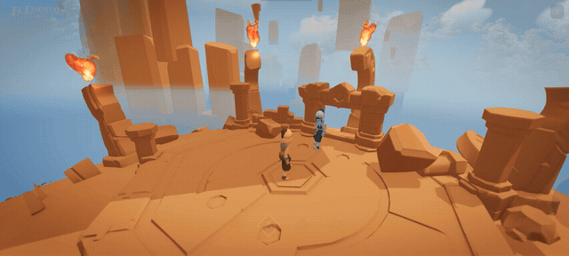<br /><sub>Струя, орбита и сфера</sub></td>
<td align="center">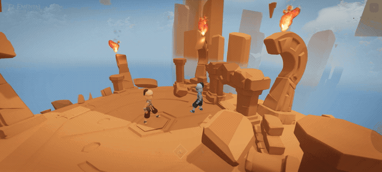<br /><sub>Огненные выстрелы</sub></td>
</tr>
<tr>
<td align="center">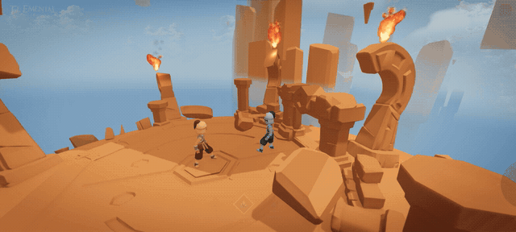<br /><sub>Атаки из орбиты</sub></td>
<td align="center">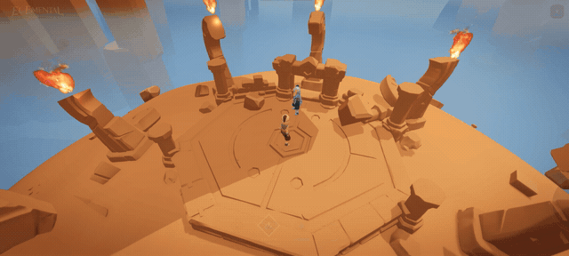<br /><sub>Огненное кольцо</sub></td>
</tr>
<tr>
<td align="center">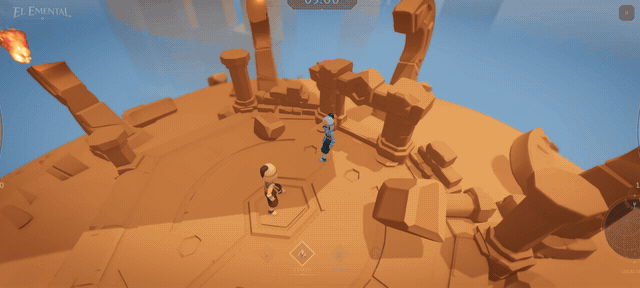<br /><sub>Контур и усиление потоком</sub></td>
<td align="center">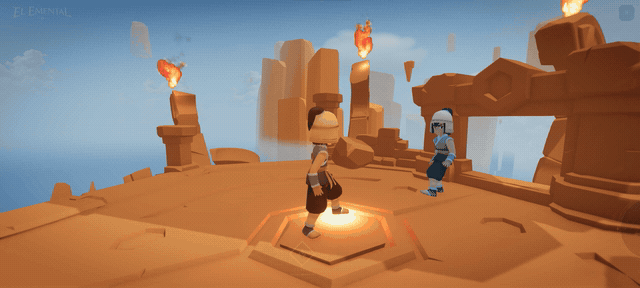<br /><sub>Реактивный полёт</sub></td>
</tr>
<tr>
<td align="center">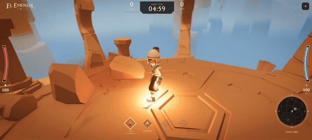<br /><sub>Полёт вдоль поверхности</sub></td>
</tr>
</table>

- **Поток меняет форму:** колесо управляет переходом от узкой струи к мощному потоку, кольцу вокруг мага и защитной сфере.
- **Заряженный фаербол:** удержание увеличивает видимую массу; отпускание выпускает огненную каплю с горячим носом, непрерывным хвостом и охлаждающимся дымом.
- **Контуры и реакции:** рисуй короткие горящие дорожки и поджигай поверхности. Проходящая через существующий очаг огненная атака может вызвать дополнительную вспышку.
- **Кольцо и сферическая волна:** накапливай наземное кольцо до отпускания или выпусти максимальную защитную сферу наружу.
- **Реактивное движение:** поднимайся на огне из стоп или лети вдоль поверхности со струями из рук и ног.
- **Связь с окружением:** пламя отклоняется у препятствий, нагревает и повреждает камни, отталкивает объекты, оставляет затухающие копоть и тление. Свет и дым сопровождают горение.

Визуальная доводка и проверка производительности продолжаются. Зелёный ареол пыли остаётся открытой проблемой по последней ручной проверке. Галерея содержит 12 записей, включая дуэль; четыре дополнительных ролика Земли ещё не готовы. Записи используют сценарные команды реальным игровым системам и не подтверждают ввод с клавиатуры или сетевой бой. Ниже показаны записи из текущей локальной арены; это не демонстрация сетевого боя.

## Управление

Мышь свободна для наведения и рисования. `W/S` — вперёд/назад, `A/D` — поворот вокруг локальной вертикали планеты. `Q` меняет плечо камеры, `Esc` открывает паузу. В локальном бою: `1` — Огонь, `2` — Земля. Клавиши `3/4` пока не открывают боевые Воду и Воздух в этой арене.

**Земля**

| Ввод | Действие |
| --- | --- |
| ЛКМ по камню / земле | Захват / формирование камня |
| Удержание ЛКМ + рисунок | Линия стены или замкнутый контур платформы |
| ПКМ: удержание → отпускание | Толчок; при удерживаемом камне — заряд и бросок |
| Колесо | Параметр текущего приёма, в том числе дистанция удержания |
| СКМ | Гравитационный захват; на удерживаемой глыбе — раскалывание |
| СКМ + круговой жест на конструкции | По часовой стрелке — восстановление, против — разбор |
| Shift + СКМ + колесо | Броня → купол → орбита; в раскрытой форме ЛКМ стреляет пластинами, ПКМ выпускает залп |
| ЛКМ + ПКМ: нажатия / удержание с линией | Серия каменных выстрелов / ряд столбов |
| Space: удержание → отпускание | Столб и прыжок; при падении — смягчение приземления |
| Shift + Space | На земле — заряд волны; в воздухе — удар при приземлении |
| Shift + W | Каменный сёрф |
| Ctrl + ПКМ / Ctrl + Space | Толчок стены / контрудар по входящим камням |

**Огонь**

| Ввод | Действие |
| --- | --- |
| ЛКМ + движение указателя | Горящий контур или нагрев наведённого объекта |
| ПКМ: удержание → отпускание | Накопление и выпуск фаербола; полный заряд сохраняется до отпускания |
| Shift + СКМ, затем колесо | Узкая струя → мощный поток → орбита → сфера |
| ЛКМ / ПКМ во время Shift + СКМ | Быстрый фаербол / закрученный огненный бур |
| Ещё шаг колеса вверх на максимальной сфере | Сферическая волна с поджиганием |
| Space: удержание | Подъём на струях из стоп; тяга нарастает |
| Shift + Space: удержание → отпускание | Заряд и выпуск наземного огненного кольца |
| Shift + W | Быстрый полёт вдоль поверхности; другие заклинания и Space имеют приоритет |

СКМ — нажатие колеса мыши. У Огня одиночное нажатие СКМ пока зарезервировано. Управление контекстное: действие зависит от удерживаемого объекта и активного поля.

## Запуск проекта

Нужны **Unity 6000.5.7f1**, Unity Hub и Git LFS. Основной текущий маршрут проверки — Windows Editor.

```sh
git lfs install
git clone https://github.com/lomatoq/El-Emental.git
cd El-Emental
git lfs pull
```

1. Добавь репозиторий в Unity Hub и открой указанной версией Editor.
2. Дождись импорта пакетов и ассетов.
3. Открой `Assets/Elemental/Content/Scenes/EarthCoreSlice.unity`.
4. Нажми Play, дождись подготовки арены и начни локальный бой с ботом через меню.

Для запуска Editor через D3D11 есть `Open-Unity-DX11.cmd`. Сборка сохранённой локальной арены: **Elemental → Build → Build Local Alpha From Saved Arena**. Версия и зависимости: [ProjectVersion.txt](ProjectSettings/ProjectVersion.txt), [manifest.json](Packages/manifest.json).

## Мультиплеер: что уже есть

Реализуется **дуэль Земли на двух игроков** через Unity Multiplayer Services Sessions/Relay, Netcode for GameObjects и Unity Transport: Host/Join по коду, готовность участников, авторитет хоста и передача состояния мира.

Два отдельных клиента уже проходили реальные проверки подключения, движения, приёма команд и отключения, в том числе с задержкой и потерями пакетов. Эти результаты относятся к протоколу 2. В текущем коде протокол 3; полный повторный сетевой приёмочный прогон ещё не закрыт. Подтверждённые попадания, убийства/респавн и двусторонний бой остаются отдельными проверками.

**Огонь доступен только в локальной дуэли.** Онлайн на четыре игрока, перенос хоста и подключение посреди матча не заявлены. `OnlineSpike` — отдельный транспортный симулятор на 2–4 участника. Настройка сервисов, запуск пары клиентов и точные ограничения: [ONLINE_ALPHA_TESTING.md](Docs/ONLINE_ALPHA_TESTING.md).

## Состояние и ближайшие шаги

| Статус | Направление |
| --- | --- |
| Есть в локальном срезе | Земля и Огонь, физические камни, построение и разрушение, бот, реакции персонажа, нокаут/респавн, меню и настройки |
| В доводке | Читаемость огня, анимации и контакт с миром, полный цикл регрессий, производительность самостоятельной сборки |
| В интеграции | Сетевая Земля: актуальный протокол, доказанный двусторонний бой, попадания и респавн |
| Лабораторные прототипы | Вода, тепло и фазовые переходы, Воздух и поля, миссии, отдельный WebLab |
| Ещё впереди | Вода и Воздух в основной дуэли, все стихии онлайн, приёмка вертикального среза и подготовка релиза |

Основной срез находится на этапе **M11 / Earth MVP**, расширенном локальным Огнём. Исторические лабораторные milestones не означают готовность всех систем в сегодняшней арене. Актуальные факты и риски: [технический статус](Docs/PROJECT_TECHNICAL_STATE.md), [трекер работ](Docs/PROJECT_EXECUTION_TRACKER.md).

## Для разработки

**Elemental → Tools → Open Elemental Suite** открывает Ability Workbench, Material Lab, Planet Lab, оценку бюджетов и проверки проекта. Правила симуляции: [архитектура](Docs/architecture.md), [ADR](Docs/adr).

```powershell
.\Scripts\Test-Unity.ps1 -UnityPath "C:\Program Files\Unity\Hub\Editor\6000.5.7f1\Editor\Unity.exe" -Platform All
```

Скрипт запускает batch-тесты. Проверки кадров, материалов, анимации и освещения требуют отдельного графического прогона Unity. Зелёные тесты не заменяют визуальную проверку и измерения текущей сборки.

## Материалы и авторство

В проекте используются сторонние материалы, включая персонажей KayKit, анимации Mixamo, эффекты Hovl и предоставленные автором проекта материалы EpicFires. У стороннего арта и инструментов сохраняются собственные условия использования; этот README не предоставляет общую лицензию на все ассеты репозитория.
